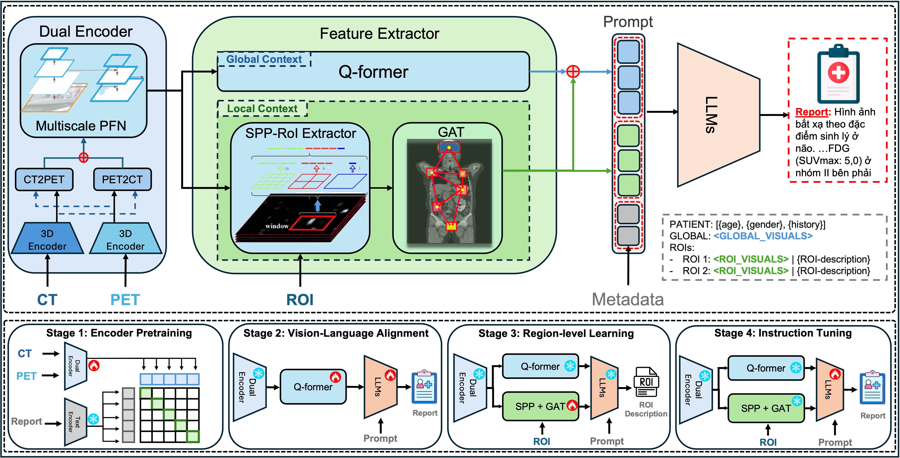
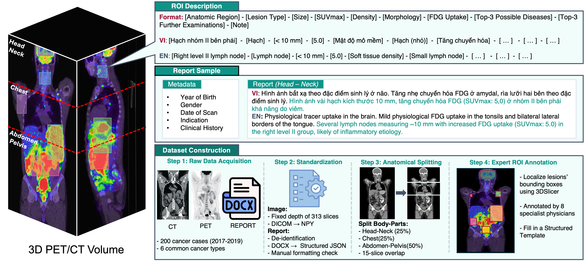

# HiRRA (Hierarchical Region-based Reporting Architecture)




HiRRA is a multimodal architecture for generating structured medical reports from 3D PET/CT volumes with ROI-level supervision. The system combines a 3D vision encoder, multi-scale feature extraction, ROI reasoning, and a large language model (LLM) decoder. This repository includes training pipelines for a multi-stage curriculum and ablation studies.

Demo data: Uploading...
Pretrained model: Uploading...

## Highlights

- PET/CT 3D fusion with a dedicated vision encoder (CTViT).
- ROI-aware feature extraction (SPP, ROI align, optional graph reasoning).
- LLM decoder with visual token injection and LoRA fine-tuning.
- Multi-stage training pipeline (Stage 1-4) + ablation setup.

## Repository Layout

```
Hirra_model/
├── figs/                  # Figures used in README
├── hirra_model/           # Core model code
│   ├── hirra.py           # Main HiRRA model
│   ├── vision_encoder/    # CTViT and PET/CT encoders
│   ├── feature_extractors/# FPN, ROI, graph reasoning modules
│   └── language_decoder/  # LLM loader and projection
├── training/
│   ├── stage1/            # Vision encoder pretraining
│   ├── stage2/            # Global context alignment
│   ├── stage3/            # ROI description alignment
│   └── stage4/            # Report generation with ROI context
└── README.md
```

## Method Overview

### Inputs

- CT volume: 3D array (Z, H, W)
- PET volume: 3D array (Z, H, W)
- ROI boxes: per-sample list of 3D boxes
- Prompt text: patient metadata + visual placeholders

Special tokens used in prompts:

- `<GLOBAL_VISUALS>`: placeholder for global visual features
- `<ROI_VISUALS>`: placeholder for ROI visual features

### Outputs

- Stage 2: global-region report
- Stage 3: ROI descriptions (one per ROI)
- Stage 4: full region report using global + ROI context

## Training Stages

### Stage 1 - Vision Encoder Pretraining

Pretrains the CTViT backbone on PET/CT inputs.

### Stage 2 - Global Context Alignment

Trains global projection and Q-Former to align PET/CT features with the LLM input space.

### Stage 3 - ROI Description Alignment

Trains ROI modules to generate structured ROI descriptions from ROI visual features.

### Stage 4 - Report Generation

Uses Stage 2 global features plus ROI context to generate the final report. LoRA is used to fine-tune the LLM while keeping most components frozen.

### Stage 4 Ablation (Skip Stage 3)

`training/stage4_ablation` trains Stage 4 directly from Stage 2 (no Stage 3 initialization). ROI modules (SPP + GCN + ROI projector) are trained from scratch while global components are frozen. This isolates the benefit of Stage 3 pretraining.

## Data Format (High Level)

Stage 3/4 JSON samples follow this structure:

```
{
  "patient_id": "...",
  "region": "chest|head_neck|abdomen_pelvis",
  "modalities": {
    "ct": ".../ct_*.npy",
    "pet": ".../pet_*.npy"
  },
  "rois": [
    {
      "index": 0,
      "label": "...",
      "description": "[Field1] - [Field2] - ...",
      "bbox": [x0, y0, z0, x1, y1, z1]
    }
  ]
}
```

Patient metadata and region reports are loaded from `report/*.json` (birth year, gender, exam date, history, indication, and region-specific report text).

## Quick Start

### 1) Environment

Create a Python environment and install requirements:

```bash
conda create -n hirra python=3.10
conda activate hirra
pip install -r training/stage4/requirements.txt
```

### 2) Training

Run a stage:

```bash
cd training/stage4
bash train_stage4.sh
```

For ablation:

```bash
cd training/stage4_ablation
bash train_stage4.sh
```

### 3) Inference

```bash
cd training/stage4
bash infer.sh
```

Ablation inference:

```bash
cd training/stage4_ablation
bash infer.sh
```

## Notes

- Dataset files are not included in this repository.
- Paths inside configs should be updated to match your local data layout.
- Most training scripts assume a single A100 80GB GPU.

## License

See `LICENSE` for licensing details.

## Citation

If you use this repository in research, please cite the corresponding paper (add citation when available).

---

This repository is released without identifying information.
